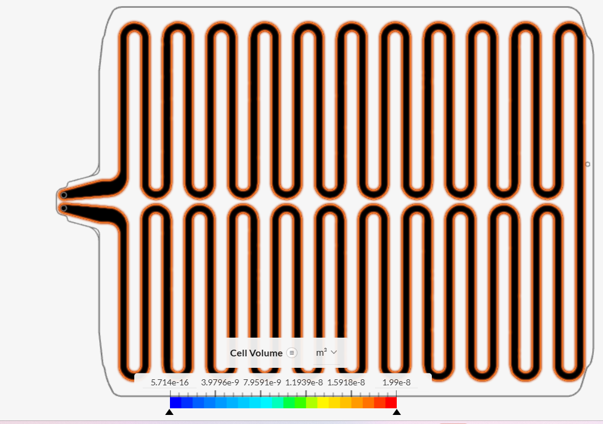
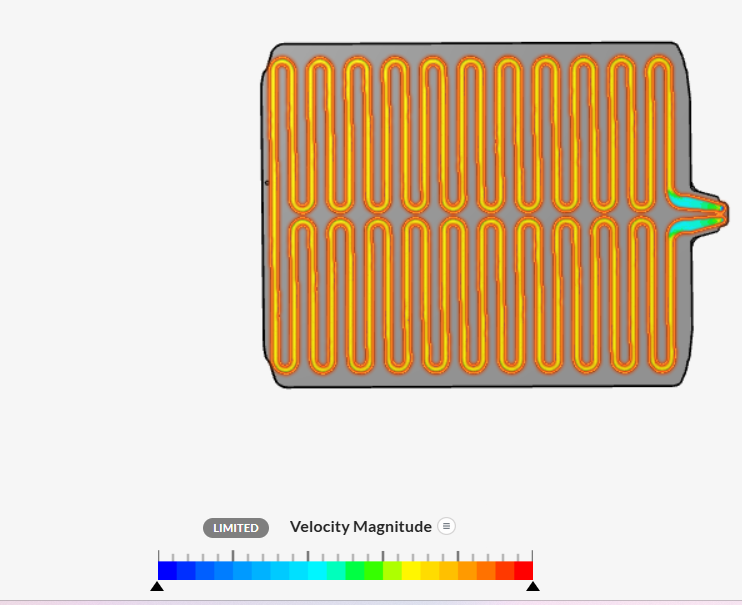
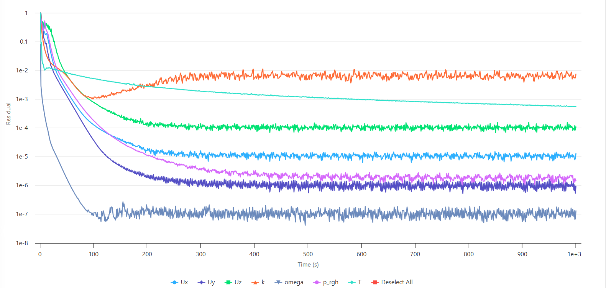
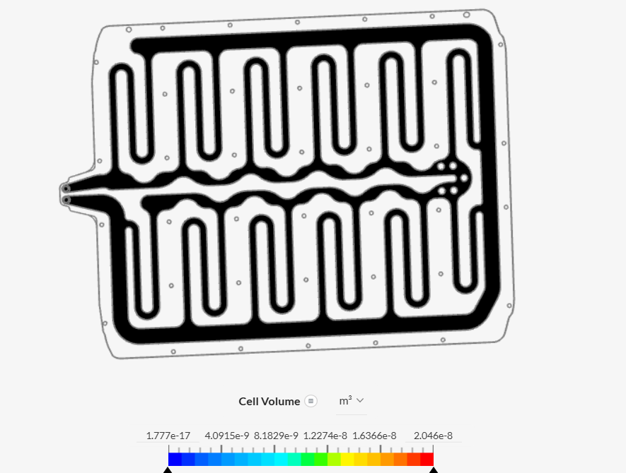
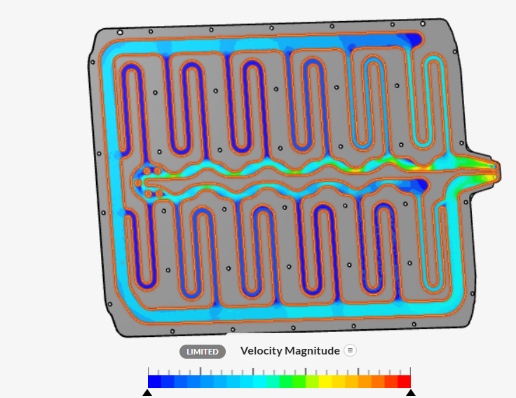
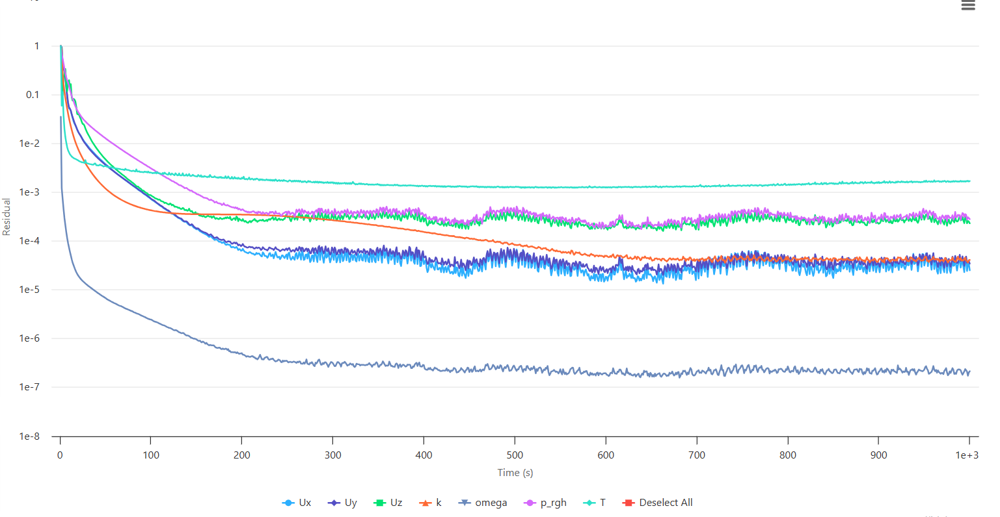

# Comparative CFD and Conjugate Heat Transfer Analysis of Cold-Plate Channel Designs

## Project Overview

This project presents a comparative Computational Fluid Dynamics (CFD) and Conjugate Heat Transfer (CHT) analysis of two cold-plate channel configurations using **SimScale**.

The simulations investigate the interaction between coolant flow and heat transfer through an aluminium cold plate subjected to a prescribed surface heat flux. Two different cooling-channel configurations are analyzed to examine their influence on coolant velocity distribution, temperature distribution, and numerical convergence.

The study is intended to demonstrate the application of CFD and CHT methods to thermal-management systems and cooling-channel design.

---

## Objectives

The main objectives of this study are:

- Analyze coolant flow through two cold-plate channel configurations.
- Investigate velocity distribution within the cooling channels.
- Analyze temperature distribution throughout the cold plate.
- Examine the influence of channel geometry on thermal behavior.
- Compare the numerical convergence behavior of the two designs.
- Develop practical experience with CHT simulation and thermal-management analysis in SimScale.

---

## Software

- **SimScale**
- CFD / Conjugate Heat Transfer
- Post-processing and visualization using SimScale

---

## Simulation Methodology

A conjugate heat transfer approach was used to simultaneously model:

1. Fluid flow through the cooling channels.
2. Heat conduction through the aluminium cold plate.
3. Heat transfer between the coolant and the solid plate.

The simulations were performed using the same general operating conditions for both channel configurations to enable a qualitative comparison.

---

## Physical Models

| Parameter | Value |
|---|---|
| **Analysis type** | Conjugate Heat Transfer (CHT) |
| **Flow regime** | Incompressible |
| **Turbulence model** | k-ω SST |
| **Coolant** | 50% Ethylene Glycol + 50% Water |
| **Solid material** | Aluminium |
| **Wall heat flux** | 400 W/m² |
| **Inlet pressure** | 2000 Pa |
| **Inlet temperature** | 20 °C |
| **Outlet pressure** | 20 Pa |
| **Outlet temperature** | 20 °C |
| **Mesh fineness** | 5 |
| **Simulation type** | Steady-state CHT |

---

## Coolant Properties

The coolant was modeled as a 50% ethylene glycol-water mixture.

The primary thermophysical properties used in the simulation were:

| Property | Value |
|---|---:|
| Density | 1079 kg/m³ |
| Dynamic viscosity | 0.003912 kg/(m·s) |
| Kinematic viscosity | 3.63 × 10⁻⁶ m²/s |
| Specific heat | 3473 J/(kg·K) |
| Thermal conductivity | 0.4257 W/(m·K) |
| Prandtl number | 31.9 |
| Turbulent Prandtl number | 0.85 |
| Reference temperature | 293.15 K |

The coolant properties were treated as constant for the present analysis.

---

# Design 1

## Geometry and Mesh

Design 1 consists of a cold plate containing multiple closely spaced serpentine cooling passages.

The geometry provides a distributed cooling-channel network across the plate, allowing the coolant to travel through multiple consecutive channel sections.

### Mesh

The simulation was performed using a mesh with **fineness level 5**.

---

## Design 1 — Temperature Distribution

The temperature field shows the thermal distribution within the cold plate under the applied surface heat flux.

The contour indicates a spatial temperature gradient across the plate, demonstrating the effect of coolant flow through the serpentine channels on heat removal.

---

## Design 1 — Velocity Distribution

The velocity field shows the coolant distribution through the serpentine cooling passages.

The flow is distributed across the multiple channel sections, with noticeable velocity variations near the inlet and outlet/manifold regions.

---

## Design 1 — Residual Convergence

The residual history shows substantial reduction from the initial values followed by fluctuations around relatively stable levels.

The solution reaches a numerically stable regime, although not all monitored residuals decrease to extremely low values.

---

# Design 2

## Geometry and Mesh

Design 2 uses a different cooling-channel configuration with a larger central distribution/manifold region and fewer serpentine passages compared with Design 1.

This configuration provides a different flow path and therefore changes the distribution of coolant velocity and thermal transport throughout the plate.

### Mesh

The same mesh fineness level of **5** was used for Design 2 to maintain consistency in the comparison.

---

## Design 2 — Temperature Distribution

The temperature field demonstrates a different spatial thermal distribution compared with Design 1.

A pronounced temperature gradient can be observed across the plate, particularly around the central distribution region and downstream sections of the cooling channels.

---

## Design 2 — Velocity Distribution

The velocity contour demonstrates stronger local variations around the central manifold and outlet region.

The channel configuration influences how coolant is distributed between the different passages, illustrating the relationship between channel geometry and flow distribution.

---

## Design 2 — Residual Convergence

The residual history shows a substantial reduction from the initial solution followed by oscillations around relatively stable levels.

Compared with Design 1, several monitored variables exhibit more noticeable fluctuations during the later stages of the simulation.

---

# Comparative Analysis

The two cold-plate configurations were compared based on their qualitative temperature and velocity fields as well as their residual histories.

| Parameter | Design 1 | Design 2 |
|---|---|---|
| Channel configuration | Distributed serpentine passages | Modified serpentine/manifold configuration |
| Mesh fineness | 5 | 5 |
| Thermal field | Distributed temperature gradient | More pronounced spatial temperature variation |
| Flow distribution | Relatively distributed through channels | Greater local velocity variation |
| Manifold effect | Less pronounced | More pronounced |
| Residual behavior | Relatively stable after initial reduction | More noticeable fluctuations |
| Numerical assessment | Stable solution regime | Stable solution regime with greater fluctuations |

---

## Engineering Interpretation

The comparison demonstrates that **cooling-channel geometry has a significant influence on both coolant distribution and thermal behavior**.

Design 1 distributes the coolant through a larger number of closely spaced passages, producing a relatively distributed flow pattern across the plate.

Design 2 uses a different manifold and channel arrangement, resulting in more noticeable local variations in velocity and a different temperature distribution.

These observations demonstrate the importance of considering both **thermal performance and hydraulic flow distribution** when designing cold plates.

A cooling-channel design should not be evaluated solely from its temperature field. Flow uniformity, pressure losses, manufacturability, and thermal uniformity should also be considered.

---

# Convergence Assessment

Residual histories were examined for both designs to evaluate numerical solution behavior.

Both simulations show:

- Significant reduction in residuals from their initial values.
- Development of relatively stable residual bands at later simulation times.
- Some oscillations in the monitored variables during the later stages.

Therefore, both cases reached a **numerically stable solution regime**, although extremely low residual values were not achieved for every monitored variable.

Residual convergence alone is not sufficient to establish complete physical convergence. Additional monitoring quantities such as mass flow rate, pressure difference, average temperature, and heat-transfer rate would provide a stronger convergence assessment.

---

# Limitations

The following limitations apply to the present study:

1. Quantitative temperature values could not be extracted because of the limitations of the available SimScale package.
2. Therefore, the thermal comparison is primarily based on the visual distribution of the temperature fields rather than exact maximum and average temperatures.
3. Numerical pressure-drop and heat-transfer-rate comparisons were not extracted.
4. The coolant properties were treated as constant rather than temperature-dependent.
5. A mesh-independence study was not performed.
6. The comparison is therefore qualitative rather than a complete quantitative optimization study.

---

# Future Work

Future improvements could include:

- Performing a mesh-independence study.
- Extracting maximum and average plate temperatures.
- Monitoring coolant outlet temperature.
- Calculating pressure drop across each design.
- Comparing mass-flow rates under the same pressure differential.
- Calculating heat-transfer rate and thermal resistance.
- Investigating additional channel geometries.
- Performing parametric optimization of channel width, spacing, and manifold geometry.
- Using temperature-dependent ethylene glycol-water properties.
- Investigating cooling-plate designs for hydrogen fuel-cell thermal management.

---

# Key Findings

- Conjugate heat transfer successfully captured the interaction between coolant flow and heat conduction in the aluminium cold plate.
- Both channel configurations produced distinct velocity and temperature distributions.
- Channel geometry strongly influences coolant distribution and thermal behavior.
- Design 1 showed relatively distributed coolant flow through its multiple serpentine passages.
- Design 2 exhibited stronger local velocity variations around its central manifold.
- Both simulations achieved substantial residual reduction and reached numerically stable solution regimes.
- Quantitative thermal performance could not be extracted because of SimScale package limitations; therefore, conclusions are based on qualitative field comparisons.

---

# Skills Demonstrated

- Computational Fluid Dynamics (CFD)
- Conjugate Heat Transfer (CHT)
- Internal Flow Simulation
- Thermal Management
- Cooling-Channel Design
- Mesh Generation
- k-ω SST Turbulence Modeling
- Pressure-Driven Flow
- Temperature-Field Analysis
- Velocity-Field Analysis
- CFD Post-Processing
- Numerical Convergence Assessment
- SimScale

---

# Conclusion

This project demonstrates a comparative CFD and CHT investigation of two cold-plate channel configurations.

The results show that changes in cooling-channel geometry can significantly affect coolant velocity distribution and the resulting temperature field within the cold plate. The study also demonstrates the importance of evaluating both thermal and hydraulic characteristics when developing cooling-channel designs.

Although quantitative temperature and heat-transfer metrics were limited by the available simulation package, the resulting flow and temperature fields provide useful qualitative insight into the influence of channel configuration on cold-plate performance.

---

## Simulation Platform

The simulations were performed using **SimScale**.

[SimScale](https://www.simscale.com/projects/mehwish_akhtar/cfd_and_thermal_analysis_of_a_cold_plate_for_hydrogen_fuel_cell_cooling_1654571654/)

---

## Acknowledgment

The cold-plate concept and tutorial workflow were based on the SimScale cold-plate simulation tutorial. The present work was independently configured and analyzed to study the behavior of two channel configurations.

The project is intended as a CFD learning and portfolio study and does not represent a validated experimental design.
